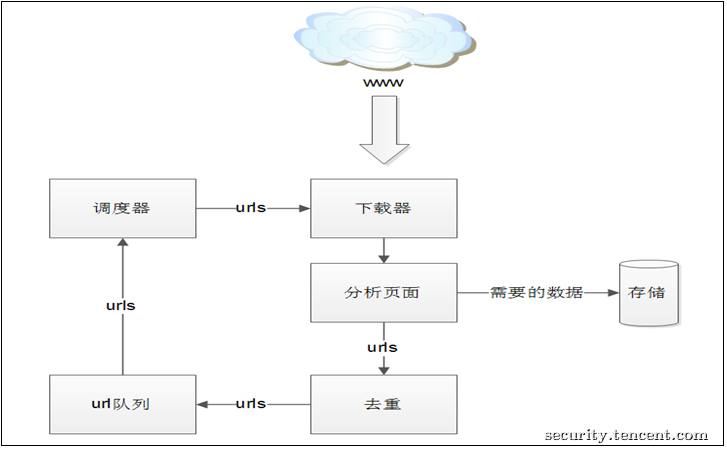
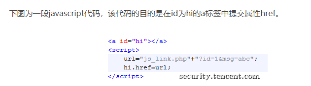
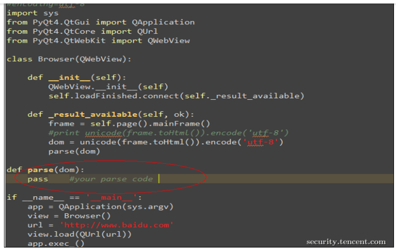
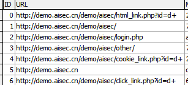

## Buchiyexiao的私人工具库（一）——自动爬虫

##### 考古学家Bcyx的一天

#### GITHUB https://github.com/buchiyexiao/Bcyx_tools

个人最开始接触Python爬虫是在大一下参加了学校的一个国创项目组，当时我负责进行爬虫代码的编写，那时候就了解了一些爬虫的技术，当时尝试了挺多技术的，比如八爪鱼这种现成包装好的爬虫软件、requests+beautifulsoup页面读取、selenium的模拟浏览器技术，不过最后随着个人原因退出了项目组，对爬虫的理解也就停留在了那个阶段

昨天考古发现了腾讯安全应急响应中心的一篇文章——[打造功能强大的爬虫利器](https://security.tencent.com/index.php/blog/msg/34)SuperSpider，虽然文章没有给代码，但是整体逻辑和基本框架已经搭建的差不太多，因此今天大概抽出了三四个小时对爬虫进行了重新的系统性了解，同时对文中提到的一些东西进行了复现

### 一、爬虫的相关介绍

爬虫的具体定义和一些特别规范化的技术讲解百度上有很多，我不再进行赘述，我简单介绍一下个人对爬虫的理解，爬虫其实就是类似一个信息收集的过程，它不仅适用于一些项目或者资料信息的收集，比如统计一下某个平台发布关于某个主题的用户的特征等，如果使用得当，它可以作为渗透测试最先站的信息收集部分获取很多诸如用户邮箱、用户名等（前提，使用得当）因为爬虫往往伴随着一个短时间内较高次数的访问，所以很容易被防守方或者是相关人员捕获然后ban IP

再者说，爬虫是很多扫描器的第一步，包括一些暗链查找的软件，都是基于爬虫进行分析和处理的，写这个工具的主要原因还是因为现在很多比赛采用的内网比赛，比赛是不允许查阅资料，而自己电脑在年初重装了一次，很多工具都没了，再加上平时不常使用，往往到关键时候想用的时候发现没有，十分的烦躁，同时为了加深自己对原理的认识，决定每周或每两周抽出三四个小时实现一个简单的小工具，方便以后个人的使用

### 二、爬虫的架构



简单来说，就是将url进行分析，然后进行一系列优化操作，再循环，直至结束，腾讯安全应急响应中心主要介绍了分析页面的相关内容。

- 静态页面链接分析

  ```html
  <a href="xxxx"></a>
  ```

  文中没有给出他具体实现的代码，我个人采用的BeautifulSoup进行的分析，所以对于标签的提取和匹配相对来说比较基础和容易

- javascript动态解析

  

  javascript动态解析目前感觉难度相对较大，主要原因是因为文中使用的PyQt4中的webkit内核进行动态执行生成html代码后再静态分析，但是由于我个人习惯python3编程，PyQt相关又觉得太过于复杂，所以我还是采用了requests这种较为大众化的代码，因此没有实现动态解析的事情，因此我个人查找了一些html，发现涉及js动态解析的代码并不多，因此并没有实现js动态解析

- 自动分析表单

  主要是对get请求进行拼接，将form表单内的内容进行匹配然后得到所需要的数据和信息

- 自动交互，主要是对button等进行一个简单的处理

- 去重

  由于很多网站数字不同的信息是基本类似或者相同的，所以去重是有必要的，尤其是一些网站以日期作为url的组成部分，因此将url中的数字替换成d+进行去重

- 具体实现的差异

  腾讯安全应急响应中心主要是接住了PyQt4，同时给出了样例代码

  

  但是个人采用的Requests+BeautifulSoup对爬取页面信息进行处理，借助SQLite3对数据进行存储，和文中一样，我们对爬虫测试平台http://demo.aisec.cn/demo/进行测试，得到爬虫信息基本全部得到

  

